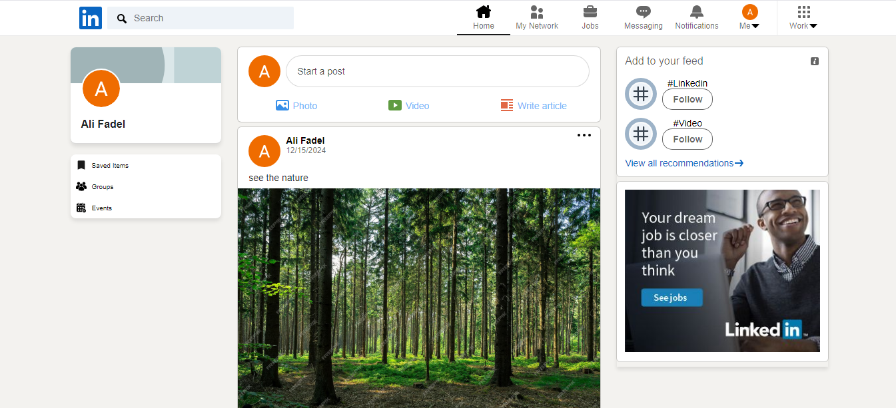

# LinkedIn Clone 🚀

## Live Demo  
  

---

## Introduction  
**LinkedIn Clone** is a sociel media platform inspired by LinkedIn. Built with React.js, Redux and Firebase, the app supports features like secure user login and registration, create new posts with images and video links. The app also come with a responsive design for all secreens.  

---

## Features  
- **Google Sign-In:** Quick and secure social login using Google.  
- **Dynamic Feedback:** Loading spinners and error messages for improved user experience.  
- **Responsive Design:** Works seamlessly on all devices—desktop, tablet, and mobile.  
- **add post functionality:** users can create new posts.  
- **add images and videos:** users can securly add images and videos in their posts.  
---

## Technologies  
- **React.js:** For building interactive and reusable UI components.  
- **Firebase:** Provides backend services for authentication, hosting, and realtime database.  
- **Redux:** For efficient state management.  
- **Styled-Components:** For modular and scalable styling.  
- **Vite:** Ensures fast development and optimized builds.  

---

## Technical Details  

### Authentication System  
- **Firebase Authentication:** Handles email/password login and social login with Google.  
  
### Create posts System  
- **Firebase Realtime database:** Handles create new posts.  
- **Database:** Display the posts for each users.  

### Responsive Design  
- Fully responsive layout optimized with `styled-components` for modern devices.  

### Redux Integration  
- Efficiently manages user state, authentication status, posts status, and loading states across the app.  

### Alerts and Feedback  
- Real-time feedback for user actions like login failures or loading states.  

